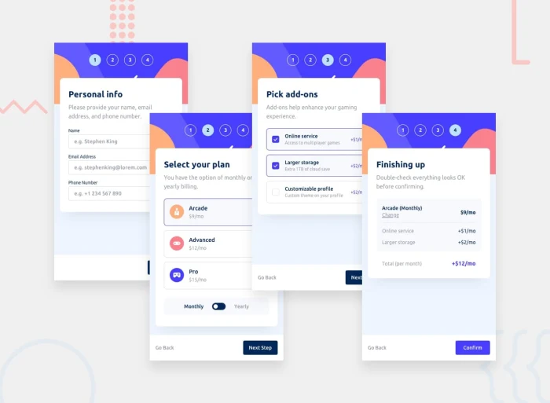

# FlowForm

FlowForm is multi-step user sign-up flow that is Accessible, responsive, and stateful.  

**Explore the app [here](https://msabin.github.io/FlowForm/)!!**

The input information will not be sent anywhere, this is a disembodied front-end design built from scratch to match JPEG screencaps of a design (see above) for [a challenge from Front End Mentor](https://www.frontendmentor.io/challenges/multistep-form-YVAnSdqQBJ).

This form runs the gamut of standard text forms, radio buttons, checklists, and page routing for a React-built Single-Page App, built using semantic HTML for a screen-readable, keyboard-navigable experience.

This project was built mobile-first using the React framework for JavaScript with Sass (SCSS) styling and a single composite state of all the pages, stored to be sent as a new-user payload to a backend if connected to one.

## Usage
Simply navigate the app in whatever way is most comfortable (e.g. point-and-click, keyboard naviation, etc.) on whatever device or font-size you like!  No data will be sent anywhere.

If you would like to try out this challenge yourself, find the specifications at [Front End Mentor](https://www.frontendmentor.io/challenges/multistep-form-YVAnSdqQBJ).  The challenge includes JPEG screenshots of what your app should look like, a file specifying a color palette and font, and some SVGs to use on the form.  Have fun!!

## Installation
Visit [here](https://msabin.github.io/FlowForm/) to play with the app in a browser immediately and you can use the browser's developer tools to explore and modify the transpiled *deployment version* of the code!

To download, explore, and modify the *source/development version* code yourself, these installation instructions should work for MacOS with the default shell:

Open a directory on your computer that you want to download this repository to and clone it from GitHub from the command line with

`git clone https://github.com/msabin/FlowForm.git`

If you don't have `npm` already installed (the package manager for JavaScript libraries) that should be [done first](https://docs.npmjs.com/downloading-and-installing-node-js-and-npm).  Then, in the directory that you cloned this repo to, run

`npm install`

This will install all the dependencies for the project and a new folder called `node-modules` should appear in your directory.  Lastly run

`npm run dev`

This should use [Vite](https://vitejs.dev/guide/) to run a local server on your machine to host the application.  The terminal should have a line that looks something like:

`Local:   http://localhost:5173/FlowForm`

The number may be different but if you put the link it gives you in your browser of choice, you should see the application running.

With Vite, changes you make to the code will be immediately reflected on your browser page.
